# Slient Cart

```
MEAN STACK APPLICATION (MongoDB,Expess.j,Angular,Node.js)
```
## Installation

### Installation of NVM

1. First download the NVM installation script using cURL as follows

        curl -o- https://raw.githubusercontent.com/creationix/nvm/v0.34.0/install.sh | bash

2. After downloading the script, run the script using bash as follows

        bash install_nvm.sh
    
3. To reflect the changes for the current user session, use following command

        source ~/.profile
    
4. Check installed NVM version as follows

        nvm --version
    
5. Install a particular version of node

        nvm install 10.15

### Install Mongodb

Mongodb can be install by following the steps from this [link](https://docs.mongodb.com/manual/tutorial/install-mongodb-on-ubuntu/) or follow the below steps. 

1. Import the public key used by the package management system.

        wget -qO - https://www.mongodb.org/static/pgp/server-4.2.asc | sudo apt-key add -

2. Create a list file for MongoDB

        echo "deb [ arch=amd64 ] https://repo.mongodb.org/apt/ubuntu xenial/mongodb-org/4.2 multiverse" | sudo tee /etc/apt/sources.list.d/mongodb-org-4.2.list

3.  Reload local package database

        sudo apt-get update

4.  Install the MongoDB packages

        sudo apt-get install -y mongodb-org

5.  Start MongoDB

        sudo service mongod start

### Install Angular CLI via npm

1. Install the angularcli

        npm install -g @angular/cli

### Run the Application 

1. Remove the package-lock.json

        rm package-lock.json

2. Install the dependencies

        npm install

3. Build the angular project 

        ng build 

4. Run the server 

        node server.js 

```
    Application will be running at http://localhost:3000 
```

# Steps to Deploy the application on the ECS Engine on Alibaba Cloud.

These are the steps

1. Launch a new ecs instance.
2. Setup SSH Connection to connect ecs instance
3. Install Nodejs using nvm
4. Install MongoDB database
5. Install Angularcli 
6. Run the application

## Follow the steps below

1. Create a new ecs instance from Alibaba Cloud Platform.

To create a new instance, you should have an active account on Alibaba Cloud Platform.After logging to Platform.

Select an ecs option from Services

Then select one image from list of options. Please select an image according to your requirement and whichever is suitable for you. So in my case I’ll select Ubuntu 18.04 64 bit.

Note: After that maybe some installation command not work if you select an image other than Ubuntu 18.04.

Next Choose instance type, Let’s choose 2 vCPU 2 GiB (I/O Optimized) ecs.t6-c1m1.large 1Mbps which is eligible for the free tier, so if your account is less than 12 months old you can run your server for free.

Next Configure instance details, this is more complicated step but we can ignore this for now.

Next Add Tags, add key-value pair for instance, but for now we’ll skip this step .Tags is useful if you use more instance it’s better to search by Tag.

Next Configure Security Group,In my opinion this steps is more important ,Where we inbound(expose our server port) and outbound(restrict to access other server)

In our case, to connect ecs instance we need open **ssh port 22** and to access our site publicly we need expose **http port 80** (when you visit any website by default it connect to port 80 )with selecting option **anywhere** for source

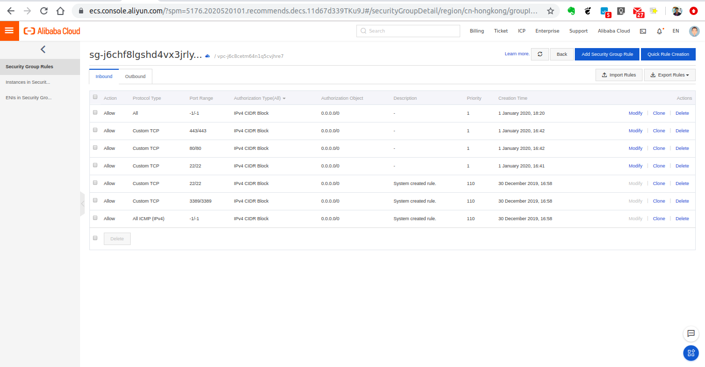

**Inbound and Outbond Source**      

1. Anywhere from anywhere we can access this port
2. Custom only provided IP access this port.
3. My IP only access this port within same server.

The console page looks like the below

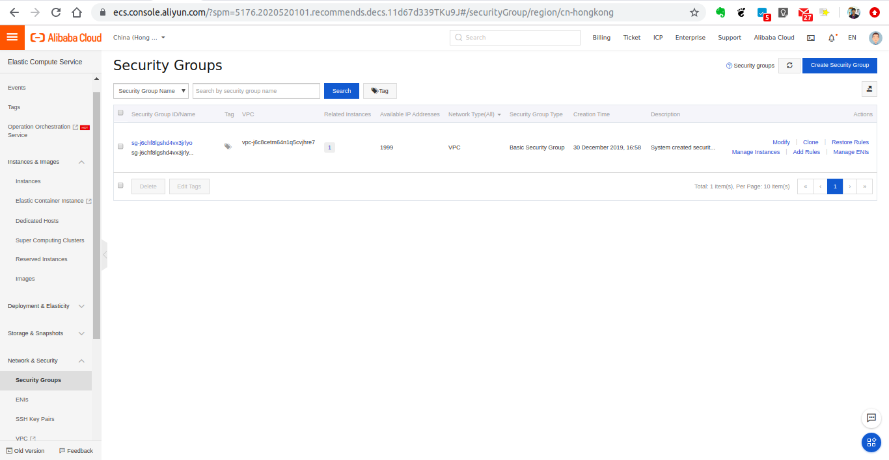

Next Click on Launch, then it’ll ask to create new key pair , which will used to connect our server using ssh with this key.

Download this key pair, and click on Launch.

2. Setup ssh connection to connect ECS instance.

After creating instance , Go to that instance. In this page there is connect button click on that connect button then you’ll see this modal.
This is can be found in the connect option.

        chmod 400 <pem file path>  

        ssh -i <pem file path> <user>@<public DNS>

        eg. ssh -i "cart.pem" root@<Internet IP Address of the instance>

3. Install Node Js on ecs instance.

    To set up Node.js on your Ubuntu instance.

    Follow the [Steps](#Installation-of-NVM)

4. Install Mongodb on ecs instance.

    To set-up Mongodb on the Ubuntu instance.

    Follow the [Steps](#Install-Mongodb)

    For more info click on the [link](https://docs.mongodb.com/manual/tutorial/install-mongodb-on-ubuntu/).

5. Install Angularcli.

    To set-up Angularcli on the Ubuntu instance.

    Follow the [Steps](#Install-Angular-CLI-via-npm)

6. Run the application.

    Follow the [Steps](#Run-the-Application)

```
Now Express App start on port 3000

Then open below url in browser

        http://<your public DNS>:3000
```

But if you close this terminal or if you perform Ctrl+C server will stop.

So to start server in the background there are multiple NPM library but we’ll use forever to start server. Here is the different option.
For more [info](https://expressjs.com/en/advanced/pm.html)

Install forever globally using npm

        npm install -g forever

Start server using forever

        forever start server.js

To see list of forever process

        forever list

To see Express Server logs

        tail -f <logfile path>

If you want to store logs in predefined file, then start server with following command

        forever start server.js -l /path/to/log/file


To access this server publicly, you’ve to open port 3000 from security group by adding into inbound rule, as we open port in **Step1**

After opening 3000 port publicly , hit below url

        http://<your pblic DNs>:3000
        

## Application ScreenShots

1. The Application Front End Part

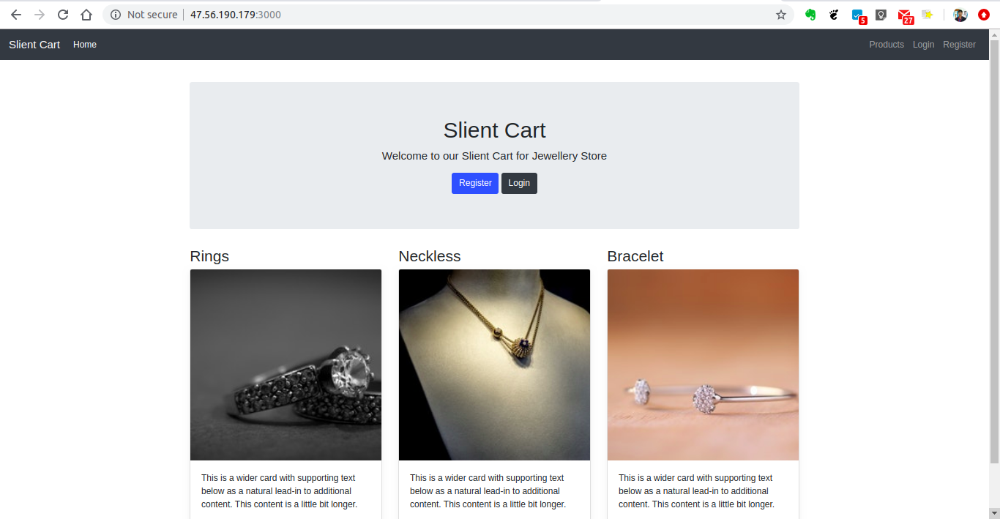

2. Register Page

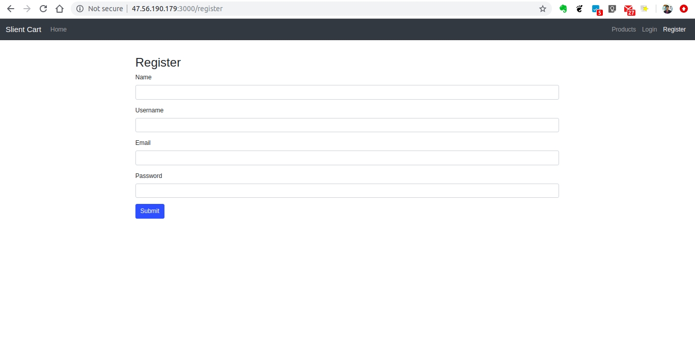

3. Login Page

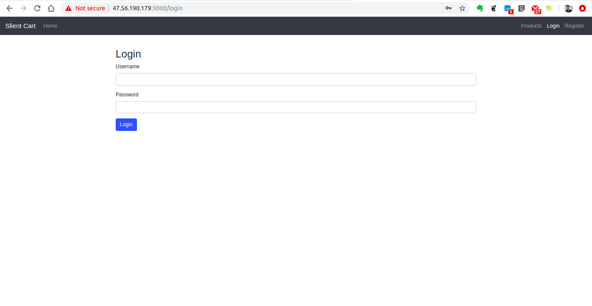

4. Profile Page

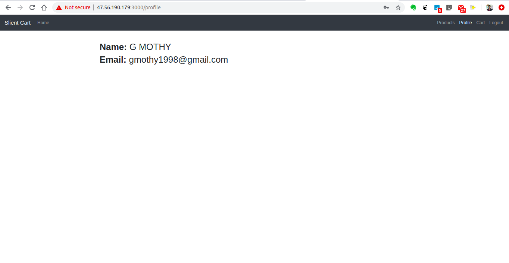

5. Custom Page of the Admin

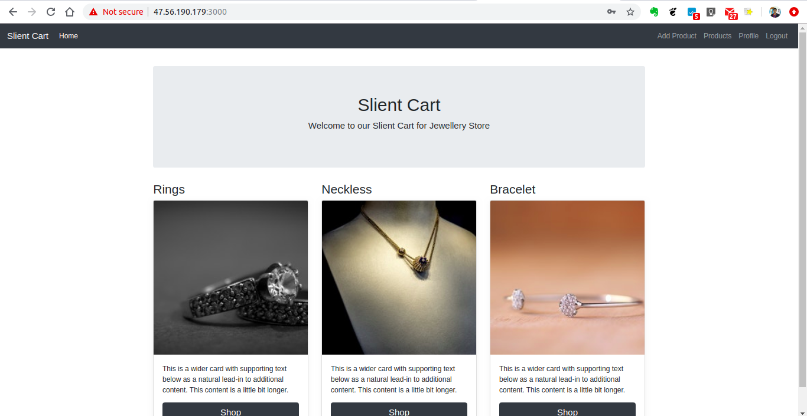

6. Add Products Page(Admin Side)

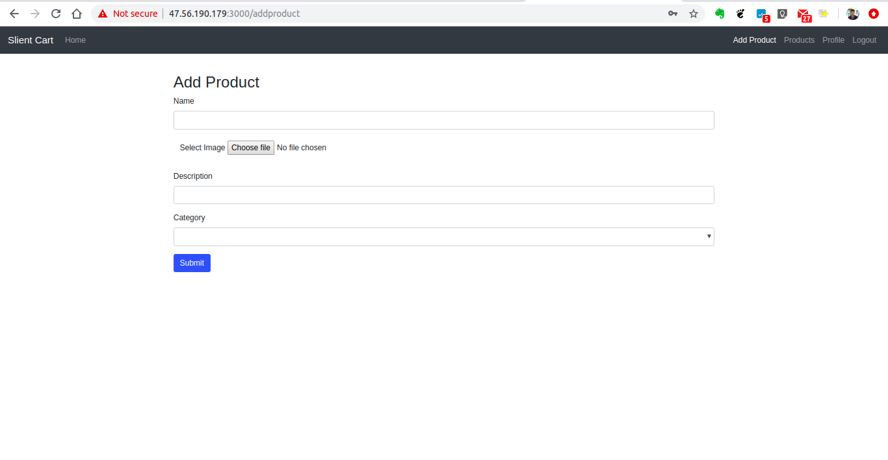

7. Edit the Products(Admin Side)

In this page the admin can edit the product details or delete the product.

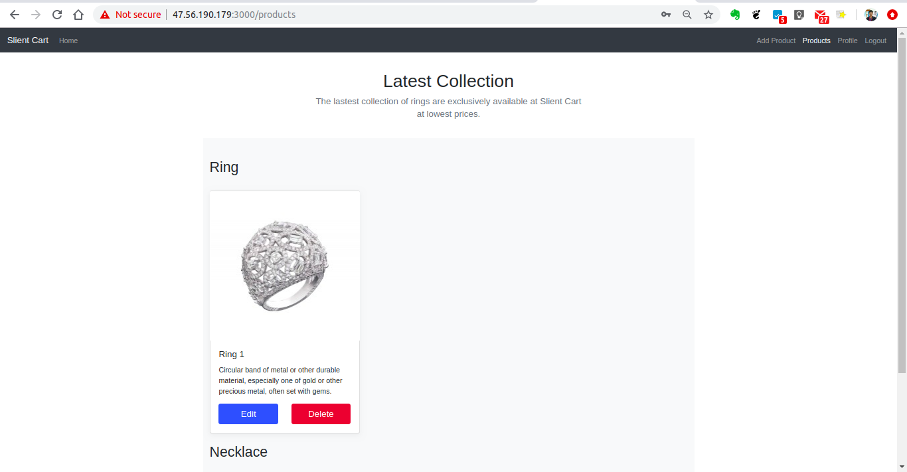

8. Products Page 

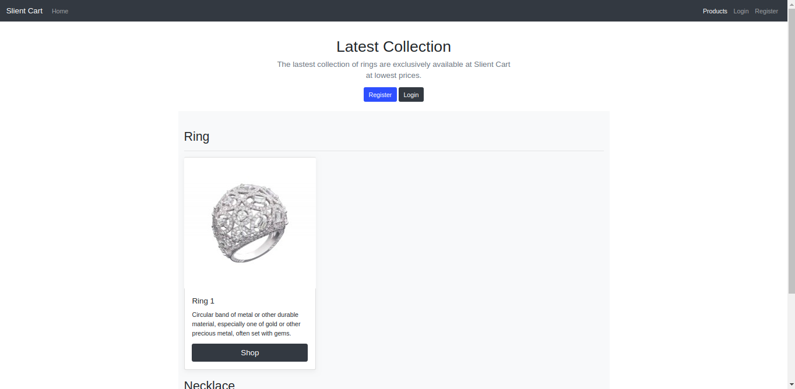

9. Customer Side User Interface without the Admin Side Features.

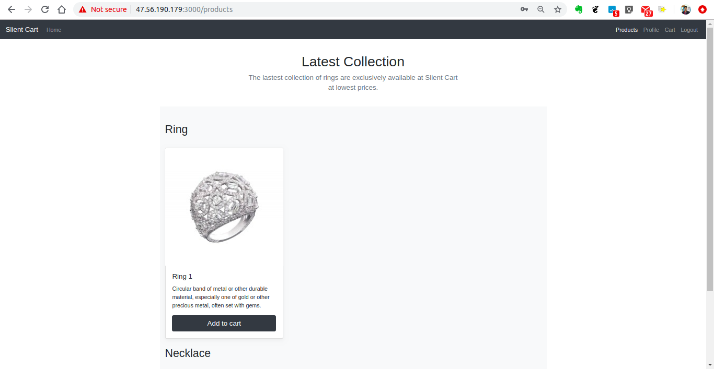

